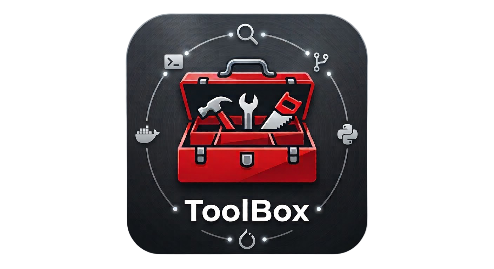
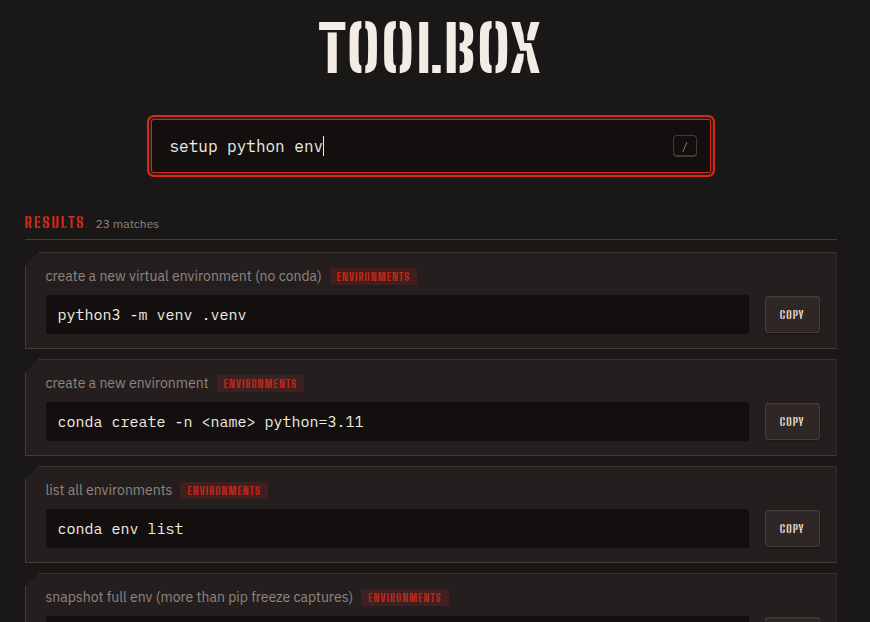
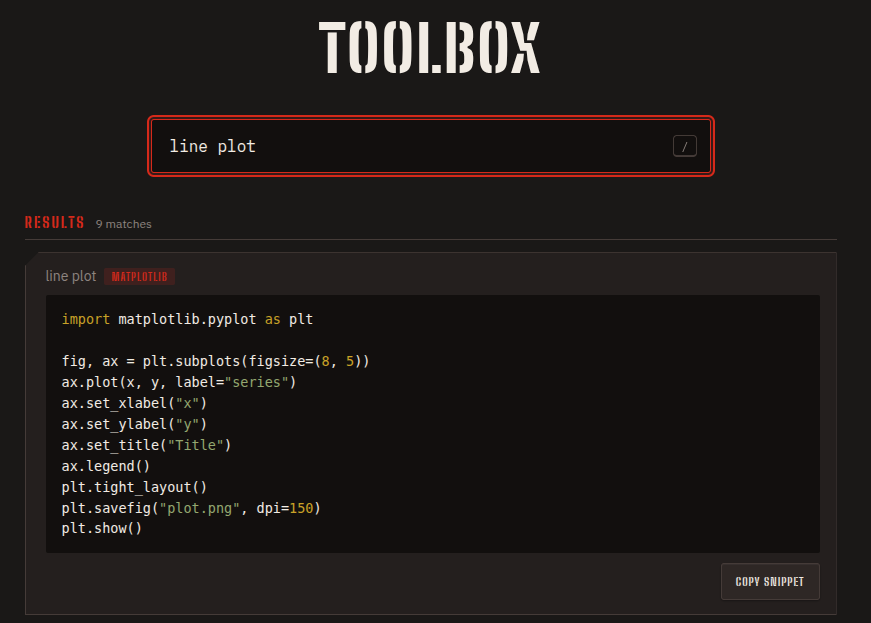
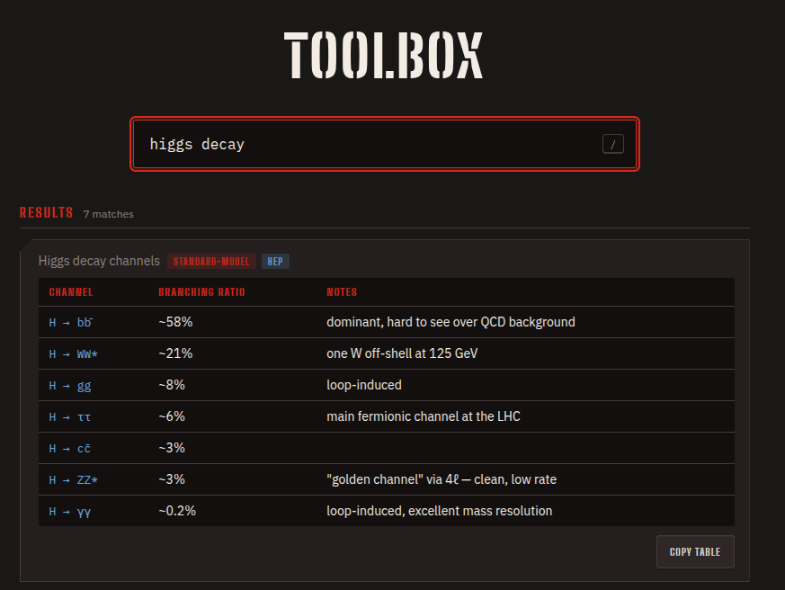
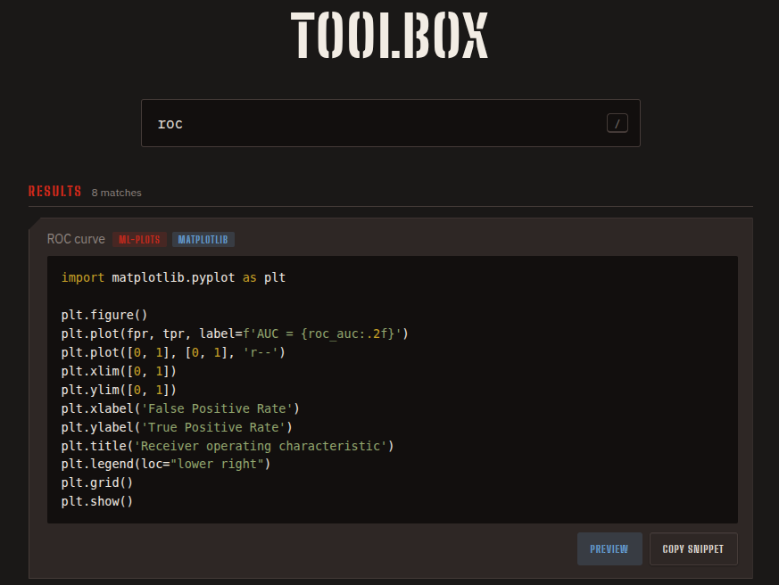

<p align="center">
  
</p>

<p align="center">
  <a href="https://github.com/JOTELLECHEA/toolbox/releases"></a>
  <a href="LICENSE"></a>
  
</p>


A personal reference of terminal commands, code snippets, and lookup tables —
the ones used often enough to need, but not often enough to remember.
Searchable through a small local web app, fully offline.

This is my own setup, not a generic template — the `.md` files are my
commands. The tool itself doesn't assume anything about what's in them
though, so if you want something like this, fork it and swap in your own
content.

<table>
  <tr>
    <td></td>
    <td></td>
  </tr>
  <tr>
    <td></td>
    <td></td>
  </tr>
</table>


## Getting started

    git clone https://github.com/JOTELLECHEA/toolbox.git
    cd toolbox
    python3 app/server.py

Then open `http://localhost:8420`.

Python 3 is the only requirement — no pip installs, no build step, nothing
to configure. `server.py` locates the repo from its own path, so it works
from anywhere:

    alias tb="python3 /path/to/toolbox/app/server.py"

Swap `/path/to/toolbox` for wherever you cloned it (same goes for the Docker
examples below). Then `tb` from any directory starts it.

Search matches against each entry's description, tags, topic name, and its
content — a command's text, a snippet's code, or a table's cells. It scores
by how many of your words appear rather than requiring an exact phrase, so
"setup python env" still finds something described as "set **up** a new
virtual environment." Exact whole-word matches rank above coincidental
substrings, so searching "roc" finds an ROC-curve snippet rather than
anything containing "p**roc**ess."

### Taking only part of it

Every topic is its own folder, so a sparse checkout pulls just the subject
you want along with the app:

    git clone --filter=blob:none --sparse https://github.com/JOTELLECHEA/toolbox.git
    cd toolbox
    git sparse-checkout set drawer/python app

## Structure

All cheatsheets live under `drawer/`, grouped by topic rather than forced
into one rigid pattern:

- A standalone tool gets its own folder: `drawer/docker/docker.md`,
  `drawer/git/git.md`.
- A broad topic holds several files, and nests further when a domain earns
  it: `drawer/python/` keeps env tooling, conda, and matplotlib at the top
  level, with `machine_learning/` and `root/` as subfolders.
- Two closely related tools can share a folder: `drawer/archives/` holds
  both `tar.md` and `zip.md`.

New topic = new file, wherever it fits. Nothing else to register — the app
finds every sheet under the repo automatically, however deep it's nested.

## Entry format

Three kinds of entry live side by side in the same files.

**A command** is one line:

    - `command here` — description here <!-- optional, extra, search terms -->

- The description is optional — a bare `` - `cmd` `` still parses and shows
  up in search, matched against the command text itself — but it's worth
  adding anyway, since it's what makes a phrase search work.
- **One command per bullet.** `` - `cmd1` / `cmd2` `` reads fine on GitHub
  but silently fails to parse as an entry — split it into two lines.

**A snippet** is boilerplate code — an H3 title, optionally tagged, right
before a fenced code block:

    ### snippet title here <!-- optional, extra, search terms -->
    ```python
    boilerplate code here
    ```

Snippets are syntax-highlighted. Python, bash, C++, and ~30 other common
languages work out of the box; LaTeX is bundled separately in `app/`.

**A table** is an H3 title followed by a markdown table — no fence:

    ### Quarks <!-- tag:hep, mass, charge -->

    | Quark | Mass | Charge |
    |-------|------|--------|
    | Up | 2.16 MeV | +2/3 |

It renders as a real table in the app and on GitHub, and every cell is
searchable. `**bold**` and `` `code` `` work inside cells.

An H3 with neither a fence nor a table after it is just a normal section
label — nothing gets forced into being an entry.

### Tags

Anything in the trailing `<!-- ... -->` comment is searchable but invisible
on GitHub. Use it for words you'd actually type that the text doesn't
already contain — the ones easy to miss are symbols (a table showing `ħ`
needs a `hbar` tag) and phrasings you'd search but didn't write ("dead
neurons" when the text says "units can die").

Two prefixes do more than search:

| Prefix | Effect |
|--------|--------|
| `tag:name` | shows `name` as a coloured pill on the card, and stays searchable |
| `image:file.svg` | attaches a preview image, shown behind a Preview button |

Image paths resolve relative to the `.md` file's own directory, and `.svg`,
`.png`, and `.webp` are accepted. SVG is best for line plots; PNG for dense
scatter plots or anything pixel-based.

    ### ROC curve <!-- tag:matplotlib, image:roc-curve.svg, curve, sensitivity -->

Pills are opt-in: tags without `tag:` stay search-only, so a long tag list
doesn't clutter the card.

### Checking your entries

    python3 app/server.py --lint

Reports any line that looks like an entry but doesn't parse. Worth running
after adding content, since a malformed entry doesn't raise an error — it
just silently never appears in search. Prose bullets that happen to start
with a backtick will show up here too; those are expected, not problems.

## Running it in Docker

An alternative to running it directly — useful on a machine that doesn't
already have Python set up the way you like it. For day-to-day use the
plain `tb` alias starts faster, since there's no container to spin up.

`app/Dockerfile` bakes in the static app itself — `server.py`, `index.html`,
the syntax highlighter, the fonts. Those rarely change, so rebuilding on the
occasions they do is fine. Your content never goes into the image: the root
`docker-compose.yml` mounts the repo in live and read-only, so editing a
`.md` file and refreshing the page works exactly like running it directly —
the container never holds a stale copy of your cheatsheets.

Build the image once:

    cd /path/to/toolbox
    docker compose build

Then start and stop it:

    docker compose up -d      # starts it in the background
    docker compose down       # stops it

Same address either way: `http://localhost:8420`.

Edits to a `.md` file show up on refresh, but changes to `server.py` or
`index.html` are baked into the image — rebuild with `docker compose up -d
--build` to pick those up.

To run those from anywhere without `cd`-ing in first:

    alias toolbox="docker compose -f /path/to/toolbox/docker-compose.yml up -d"
    alias toolbox-down="docker compose -f /path/to/toolbox/docker-compose.yml down"
